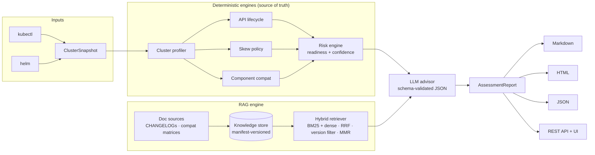

# k8s-upgrade-advisor

**AI Kubernetes Upgrade Intelligence Platform** — plan, validate, and execute cluster
upgrades with deterministic compatibility analysis and RAG-grounded AI reasoning.

Supports **EKS · GKE · AKS · OpenShift · Rancher (RKE2/k3s) · kubeadm · kind**.

```
verdict: not-ready  readiness: 47/100 (cap 95)  confidence: 94/100
findings: 6 (0 blocking)
  🟠 FlowSchema (flowcontrol.apiserver.k8s.io/v1beta2) removed in 1.29
  🟠 cert-manager 1.11.0 does not support Kubernetes 1.29
  🟠 Karpenter 0.31.0 does not support Kubernetes 1.29
  🟡 3-hop upgrade path: control plane must move one minor at a time
```
*(actual output for the bundled EKS 1.26→1.29 fixture — try it:
`k8s-upgrade-advisor assess -s 1.26 -t 1.29 --snapshot tests/fixtures/eks_1_26.json --dry-run`)*

## The core idea

LLMs are excellent at *explaining and planning* and terrible at being a
*source of truth for version compatibility*. This platform is built around that split:

| Layer | Produces | Trust |
|---|---|---|
| **Deterministic engines** | API removal findings, version-skew violations, component compatibility verdicts, readiness score | Provable from cluster data + static lifecycle tables |
| **Hybrid RAG** | Release-note & compat-matrix evidence, cited as `[DOC n]` | Grounded in fetched upstream docs |
| **LLM (gpt-4o)** | Narrative, upgrade sequencing, runbooks, downtime reasoning | Schema-validated; **cannot** change scores, add blockers, or cite documents that weren't retrieved |

The trust boundary is enforced *after* the model responds, not by prompt hope:
LLM findings are demoted to non-blocking, invalid citations are dropped, and the
deterministic verdict always stands.

## What it analyzes

- **API lifecycle** — deprecated/removed APIs from 1.16→1.33 (static table, never guessed),
  detected against what the cluster actually serves; PSP/dockershim usage evidence upgrades
  findings to blocking
- **Version skew policy** — kubelet n-2/n-3 windows per hop, multi-hop sequencing constraints
- **Component compatibility** — CNI (Cilium/Calico/VPC-CNI), CSI drivers, service mesh
  (Istio/Linkerd), GitOps (Argo CD/Flux), autoscaling (Karpenter/CA/KEDA), cert-manager,
  ingress-nginx and more — versions resolved from **Helm releases → image tags → presence**
- **KEP-level behaviour changes** — dockershim removal, PSP removal, in-tree cloud provider
  removal, cgroup v1 maintenance, registry freeze
- **Upgrade planning** — per-distribution control-plane/addon/node-pool sequencing with real
  commands (eksctl/gcloud/az/kubeadm/oc), rollback reality (managed control planes can't
  downgrade), downtime estimation from replica/PDB facts

## Quick start

```bash
pip install -e ".[api]"           # add [rag] for semantic embeddings

# 1. Snapshot a cluster (only step that needs kubectl/helm access)
k8s-upgrade-advisor snapshot cluster.json --context prod

# 2. Build the knowledge base (optional but recommended)
k8s-upgrade-advisor collect  -s 1.28 -t 1.31
k8s-upgrade-advisor build-kb -s 1.28 -t 1.31

# 3. Assess — deterministic only (no API key needed):
k8s-upgrade-advisor assess -s 1.28 -t 1.31 --snapshot cluster.json --dry-run

#    …or with the full AI narrative:
export OPENAI_API_KEY=sk-...
k8s-upgrade-advisor assess -s 1.28 -t 1.31 --snapshot cluster.json
```

Reports land in `reports/` as **Markdown + HTML + JSON** — all rendered from the same
structured `AssessmentReport`; nothing ever regex-parses LLM prose.

### CI gating

```bash
k8s-upgrade-advisor assess -s 1.28 -t 1.31 --snapshot cluster.json \
  --dry-run --json --fail-on not-ready
# exit 0 = gate passed · 20 = readiness gate failed · 69/78 = infra/config errors
```

### Server + UI

```bash
k8s-upgrade-advisor serve            # http://localhost:8080 — web UI
                                     # /docs — OpenAPI · /metrics — Prometheus
helm install advisor deploy/helm/k8s-upgrade-advisor   # in-cluster
```

## Architecture



Full architecture, sequence diagrams, and decision records: [`docs/`](docs/).

## Reliability & operations

- **Graceful degradation** — no sentence-transformers → hash-embedding + BM25 hybrid still
  works; no KB → deterministic-only with lowered confidence; LLM failure → deterministic
  report ships with a degradation note
- **Resilience** — retry with jittered backoff and a circuit breaker around the LLM; ETag
  caching + retries for doc fetching; concurrent kubectl collection
- **Observability** — structlog structured logging, Prometheus metrics
  (assessments, LLM latency, retrieval latency, KB staleness), `/livez` `/readyz`,
  optional OpenTelemetry tracing
- **Honest scoring** — missing evidence *caps* readiness and lowers confidence; it can
  never raise a score. Every cap ships with its reason.

## Development

```bash
pip install -e ".[api,dev]"
pytest              # 120+ tests, seconds, no network/kubectl/LLM needed
ruff check src tests
```

See [`docs/development.md`](docs/development.md) for the developer guide and
[`docs/adr/`](docs/adr/) for the decisions behind the design.

## License

Apache-2.0
