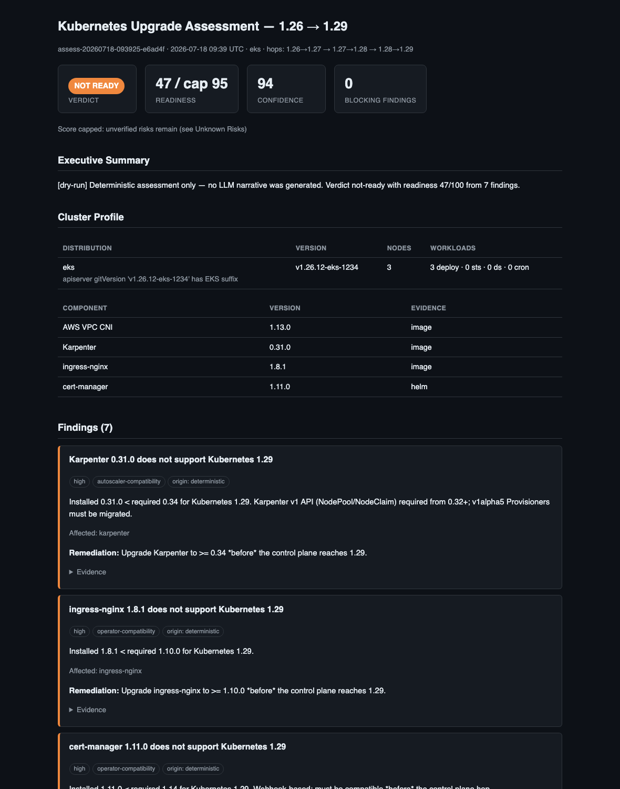
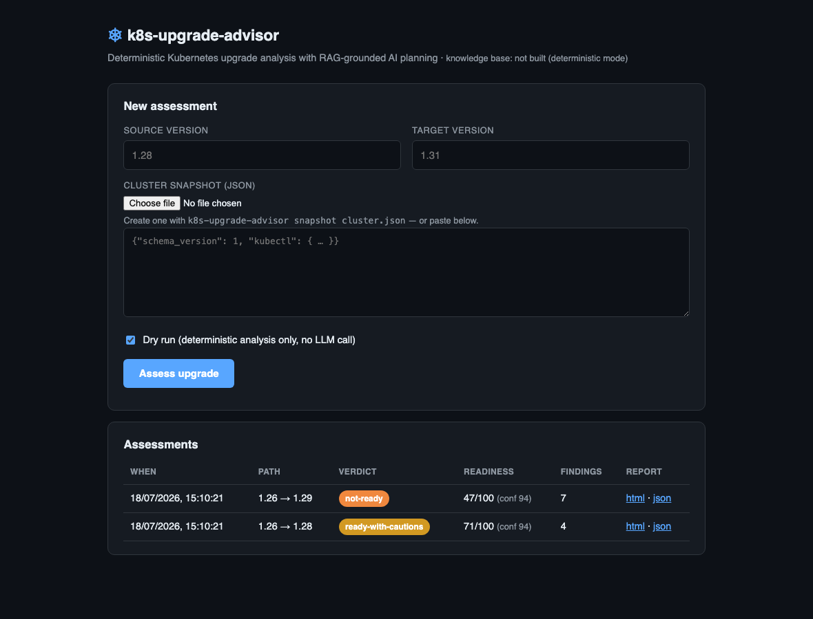
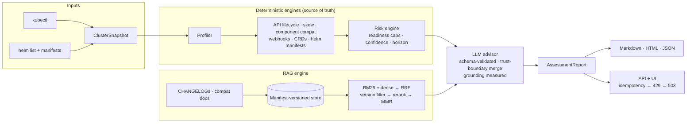

# k8s-upgrade-advisor

**AI Kubernetes Upgrade Intelligence Platform** — plan, validate, and gate cluster
upgrades with deterministic compatibility analysis and RAG-grounded AI reasoning.

[](https://github.com/ravisinghrajput95/k8s-upgrade-advisor/actions/workflows/ci.yml)
[](https://github.com/ravisinghrajput95/k8s-upgrade-advisor/releases)
[](https://github.com/ravisinghrajput95/k8s-upgrade-advisor/pkgs/container/k8s-upgrade-advisor)
[](pyproject.toml)
[](LICENSE)

Supports **EKS · GKE · AKS · OpenShift · Rancher (RKE2/k3s) · kubeadm · kind**.



## Highlights

- **Deterministic first, LLM second** — every compatibility fact comes from static
  lifecycle tables + cluster evidence; the LLM narrates and plans but **cannot alter
  verdicts, add blockers, or fabricate citations** (enforced in code, proven by tests)
- **Real Kubernetes depth** — API removals 1.16→1.33 with per-hop detection, version
  skew policy (kubelet & kube-proxy), per-provider in-tree cloud removal staging,
  admission-webhook deadlock analysis, CRD storage-version debt, Helm manifest scanning
- **Honesty as a feature** — missing evidence *caps* readiness; targets beyond the
  reviewed tables trigger an explicit knowledge-horizon cap; LLM grounding is measured
  per assessment, not assumed
- **189 offline tests in <3s** — no cluster, no network, no LLM needed
- **Runs as a service** — published container + Helm chart, stateless replicas,
  rate limiting + idempotency + load shedding, shipped SLO alerts, DR runbook
- **[Example report](examples/eks-1.26-to-1.29.md)** — see the output without running anything

## Try it in 30 seconds


```bash
pip install -e ".[api]"
k8s-upgrade-advisor assess -s 1.26 -t 1.29 \
  --snapshot tests/fixtures/eks_1_26.json --dry-run
```

```
verdict: not-ready  readiness: 47/100 (cap 95)  confidence: 94/100
findings: 7 (0 blocking)
  🟠 FlowSchema (flowcontrol.apiserver.k8s.io/v1beta2) removed in 1.29
  🟠 cert-manager 1.11.0 does not support Kubernetes 1.29
  🟠 Karpenter 0.31.0 does not support Kubernetes 1.29
  🟡 3-hop upgrade path: control plane must move one minor at a time
  ⚪ Unused auto-generated ServiceAccount tokens are invalidated (1.29)
```

No API key required — deterministic mode is fully functional. Add `OPENAI_API_KEY`
and drop `--dry-run` for the AI narrative, risk story, and refined runbook.

## The core idea

LLMs are excellent at *explaining and planning* and terrible at being a
*source of truth for version compatibility*. This platform is built around that split:

| Layer | Produces | Trust |
|---|---|---|
| **Deterministic engines** | API removal findings, skew violations, compatibility verdicts, readiness score | Provable from cluster data + sourced static tables |
| **Hybrid RAG** | Release-note & compat-matrix evidence, cited as `[DOC n]` | Grounded in fetched upstream docs |
| **LLM (gpt-4o)** | Narrative, sequencing, runbooks, downtime reasoning | Schema-validated; citation-less findings demoted; grounding ratio measured |

The trust boundary is enforced *after* the model responds, not by prompt hope.

## What it analyzes

- **API lifecycle** — deprecated/removed APIs from 1.16→1.33 (static table, never guessed),
  detected against what the cluster actually serves; usage evidence upgrades findings to blocking
- **Version skew policy** — kubelet and kube-proxy n-2/n-3 windows per hop,
  kube-proxy-newer-than-apiserver violations, multi-hop sequencing constraints
- **Component compatibility** — CNI (Cilium/Calico/VPC-CNI), CSI drivers, service mesh
  (Istio/Linkerd), GitOps (Argo CD/Flux), autoscaling (Karpenter/CA/KEDA), cert-manager,
  ingress-nginx and more — versions resolved from **Helm releases → image tags → presence**,
  matrices tagged published-vs-inferred with upstream sources
- **KEP-level behaviour changes** — dockershim, PSP removal (with Pod Security Admission
  label verification), per-provider in-tree cloud staging (AWS 1.27, OpenStack 1.26,
  Azure/GCE/vSphere 1.29+), ServiceAccount token lifecycle, registry freeze
- **Admission webhook mechanics** — `failurePolicy: Fail` without scoping selectors
  (the upgrade-deadlock configuration), long timeouts
- **CRD storage versions** — `status.storedVersions` migration debt
- **Helm release manifests** — scanned against the removal table (the `mapkubeapis` problem)
- **Upgrade planning** — per-distribution sequencing with real commands
  (eksctl/gcloud/az/kubeadm/oc), rollback reality (managed control planes can't downgrade),
  downtime estimation from replica/PDB facts

## Server + web UI

```bash
k8s-upgrade-advisor serve       # http://localhost:8080 · /docs · /metrics
helm install advisor deploy/helm/k8s-upgrade-advisor --set image.tag=v2.2.0
```



## Architecture



Full architecture, sequence diagrams, RAG design, and decision records: [`docs/`](docs/).

## Reliability & operations

- **Graceful degradation ladder** — no embeddings → hash+BM25 hybrid; no KB →
  deterministic-only with lowered confidence; LLM failure → deterministic report with
  a degradation note
- **Admission controls** — idempotency cache (identical submissions return the cached
  report), token-bucket rate limiting (429), concurrency load shedding (503)
- **Observability** — structured logs with request-ID correlation, Prometheus metrics
  (per-stage latency, tokens, cost, grounding ratio, KB staleness), optional OTel traces
- **Operations contract** — [SLOs, error-budget policy, a 10k-cluster capacity model,
  SLO-based alert rules shipped in the chart, and a DR runbook](docs/operations.md)
  where worst-case recovery is ~15 minutes

## How this was built

The repo evolved through explicit review-driven iterations, each committed separately:
a production-readiness review (deployment-path and runtime fixes), an SRE hardening
round, a Kubernetes-domain accuracy pass against SIG-level review, and an AI-quality
round (reranking, grounding measurement). The reasoning behind the four load-bearing
design decisions lives in [`docs/adr/`](docs/adr/) — deterministic-first analysis,
schema-validated LLM output, hybrid retrieval with hard version filtering, and
pluggable embeddings with graceful degradation.

## Development

```bash
pip install -e ".[api,dev]"
pytest              # 189 offline tests, <3s — no cluster/network/LLM
ruff check src tests
```

Developer guide: [`docs/development.md`](docs/development.md) · API reference:
[`docs/api.md`](docs/api.md) · RAG design: [`docs/rag.md`](docs/rag.md)

## License

Apache-2.0
