# AI Kubernetes Upgrade Advisor

AI-powered Kubernetes upgrade feasibility, compatibility, and risk assessment
with a **RAG knowledge base** (release notes + operator compatibility matrices).

```
Cluster Inventory
      +
Target Version
      ↓
  Retriever  ←─── FAISS (release notes, compat matrices)
      ↓
Relevant Docs
      ↓
  OpenAI gpt-4o
      ↓
Assessment Report  (Markdown + HTML)
```
## Supports
- EKS
- AKS
- GKE
- OpenShift
- Kubeadm
- RKE2
- K3s
- Kind
- Docker Desktop
---

## Features

- AI-powered Kubernetes upgrade assessment
- RAG-backed compatibility analysis
- Platform-aware scoring
- EKS, AKS, GKE, OpenShift, Kind, Docker Desktop support
- Confidence and readiness scoring
- Unknown risk identification
- HTML and Markdown reports
- Evidence-based findings
- Upgrade runbook generation

---

## Architecture


---

## Requirements

- Python 3.10+
- `kubectl` configured against your cluster
- OpenAI API key

---

## Installation

```bash
git clone https://github.com/ravisinghrajput95/AI-Kubernetes-Upgrade-Advisor
cd AI-Kubernetes-Upgrade-Advisor
pip install -r requirements.txt
export OPENAI_API_KEY="sk-..."
```

---

## Quick Start

```bash
# Full pipeline: collect docs → build KB → assess cluster
python main.py --source 1.27 --target 1.29
```

Reports are saved to `reports/`.

---

## Phases

### Phase 1 — Knowledge Collection
Scrapes and caches docs for:
- Kubernetes release notes (all intermediate versions)
- Kubernetes deprecated/removed API guide
- cert-manager, ingress-nginx, metrics-server, Argo CD
- Istio, Cilium, Karpenter, CSI drivers (EBS/GCP/Azure)

```bash
python main.py -s 1.27 -t 1.29 --collect-only
# Optional: limit to specific components
python main.py -s 1.27 -t 1.29 --collect-only --components cert_manager ingress_nginx
```

Outputs to `kb/raw/*.json`. Re-runs use the cache unless `--force-collect`.

### Phase 2 — Knowledge Base Build
Chunks docs → generates embeddings (`all-MiniLM-L6-v2`) → FAISS index.

```bash
python main.py -s 1.27 -t 1.29 --build-kb
```

Outputs: `kb/faiss.index`, `kb/chunks_meta.pkl`

### Phase 3 — Assessment
1. Collects live cluster data via kubectl
2. Runs multi-query retrieval against FAISS
3. Streams full assessment from OpenAI gpt-4o
4. Saves Markdown + HTML reports

```bash
python main.py -s 1.27 -t 1.29 --assess
```

---

## All Flags

```
Phase control:
  --collect-only          Phase 1 only (scrape docs)
  --build-kb              Phase 2 only (build FAISS index)
  --assess                Phase 3 only (assessment)
  --force-collect         Re-scrape even if cached
  --force-kb              Rebuild FAISS index even if it exists
  --components NAME…      Limit collection to specific components

Cluster data:
  --cluster-data FILE     Load pre-collected cluster JSON
  --dump-cluster FILE     Save collected cluster data to JSON
  --skip-collect-cluster  Skip kubectl entirely

Output:
  --md FILE               Markdown report output path
  --html FILE             HTML report output path
  --no-save               Do not save reports
  --no-color              Disable ANSI colour
  --dry-run               Build prompt, skip OpenAI call
  --top-k N               KB chunks to retrieve (default: 20)
  --model MODEL           OpenAI model (default: gpt-4o)
```

---

## Common Workflows

```bash
# Snapshot cluster + assess offline later
python main.py -s 1.27 -t 1.29 --assess --dump-cluster cluster_$(date +%Y%m%d).json

# Use saved snapshot (no live kubectl needed)
python main.py -s 1.27 -t 1.29 --assess --cluster-data cluster_20260603.json

# CI / non-interactive
python main.py -s 1.27 -t 1.29 --no-color --md report.md --html report.html

# Refresh KB after a new Kubernetes release
python main.py -s 1.28 -t 1.30 --collect-only --force-collect
python main.py -s 1.28 -t 1.30 --build-kb --force-kb
```

---

## Project Structure

```
k8s-upgrade-assess/
├── main.py                   # CLI entrypoint (all 4 phases)
├── requirements.txt
├── .env.example
├── .gitignore
├── README.md
├── k8s_assess/
│   ├── __init__.py
│   ├── collector.py          # Phase 1: web scraping
│   ├── knowledge_base.py     # Phase 2: chunking + FAISS
│   ├── retriever.py          # Phase 3: retrieval + OpenAI
│   └── reporter.py           # Phase 4: Markdown + HTML
├── kb/
│   ├── raw/                  # Scraped docs (JSON)
│   ├── faiss.index           # Vector index
│   └── chunks_meta.pkl       # Chunk metadata
└── reports/                  # Generated reports
```

---

## Environment Variables

| Variable         | Required | Description             |
|------------------|----------|-------------------------|
| `OPENAI_API_KEY` | Yes      | OpenAI API key (`sk-…`) |
| `KUBECONFIG`     | No       | Path to kubeconfig      |

---
