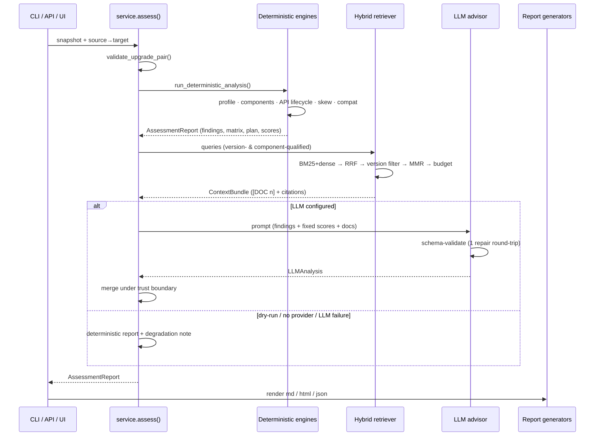

# Architecture

## Module map

| Module | Responsibility |
|---|---|
| `config` | pydantic-settings tree, env-overridable (`K8S_ADVISOR_*`), validated at startup |
| `models` | Domain schema: `ClusterSnapshot` (input), `AssessmentReport` (output), `LLMAnalysis` (the only thing the LLM may produce) |
| `collectors` | kubectl (concurrent, return-code-based) + helm collection + filtered apiserver deprecated-API metrics → snapshot; save/load for air-gapped flows |
| `analysis` | **Upgrade Analyzer + Compatibility Engine + Risk Engine** — deterministic: API lifecycle, skew policy, cluster profiling, component detection, compat matrices, planner, readiness scoring |
| `knowledge` | **Knowledge Base + Embedding Service** — source registry, resilient fetcher, structure-aware chunker, pluggable embedders, manifest-versioned store |
| `retrieval` | **RAG Engine** — BM25 + dense arms, RRF fusion, hard version filtering, MMR, budgeted context assembly |
| `llm` | **Recommendation Engine** — provider abstraction (retry/circuit-breaker), grounded prompts, schema validation with one repair round-trip, trust-boundary merge |
| `reporting` | **Report Generator** — Markdown/HTML/JSON from `AssessmentReport`, never from prose |
| `api` | **Backend API** — FastAPI, health/readiness, Prometheus `/metrics`, optional OTel |
| `frontend` | Static single-page UI, bundled as package data inside the wheel and served by the API |
| `service` | Orchestrator used identically by CLI, API, and tests |
| `observability`, `resilience`, `errors` | structlog, metrics registry, retry/breaker, typed failures with exit codes |

## Assessment sequence

## The trust boundary

The single most important design rule: **information flows from high-trust to
low-trust layers, never back.**

1. Deterministic engines compute findings, the compatibility matrix, readiness,
   confidence, and the verdict. These are functions of cluster data and static
   tables — reproducible and testable.
2. The LLM receives those results as *fixed constraints* plus retrieved documents,
   and returns `LLMAnalysis` (narrative, plan refinement, extra observations).
3. The merge step (`llm/advisor.py`) enforces:
   - scores/verdict: untouched by the model,
   - model findings: `origin=llm`, never `blocking`, severity capped at HIGH,
     duplicates dropped,
   - citations: refs not present in the retrieved set are discarded,
   - plan: hop sequence is recomputed, checklists merge append-only,
     deterministic rollback preserved if the model omits one.

A prompt-injected or hallucinating model can therefore make the *narrative* worse,
but cannot flip a BLOCKED cluster to READY, invent a compatibility verdict, or
fabricate a source.

## Scoring model

- **Readiness** (0–100): starts at 100, penalized per finding severity
  (critical 30 · high 12 · medium 5 · low 2), then **capped** by evidence quality
  (unobservable cluster → 60, target beyond the reviewed table horizon → 70,
  mostly-unresolved versions → 80, any unknowns → 95; lowest applicable cap wins).
  Verdict: ≥85 READY · ≥65 READY-WITH-CAUTIONS · else NOT-READY; any blocking
  finding forces BLOCKED.
- **Confidence** (0–100): how much we could see — critical-command coverage 45%,
  overall command success 25%, component version resolution 20%, KB availability 10%.
- Missing data can lower both numbers; nothing can raise them except better evidence.

## Failure domains & degradation

| Failure | Behaviour |
|---|---|
| sentence-transformers not installed | Hash-embedding backend + BM25 arm (logged fallback) |
| KB never built | Deterministic-only; unknown-risk entry added; readiness capped via unknowns |
| Doc fetch fails | Retry w/ backoff → stale cache if present → source skipped |
| LLM 429/5xx | Retry w/ jitter + Retry-After; circuit opens after N consecutive failures |
| LLM invalid JSON | One repair round-trip with the validation errors; then degrade |
| LLM totally down | Deterministic report ships with `[degraded]` note |
| kubectl commands fail | Per-command; critical-coverage cap kicks in; expected-missing per flavour excluded |
